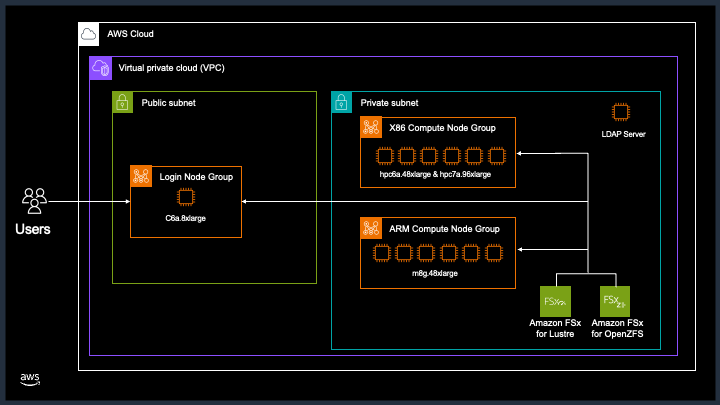
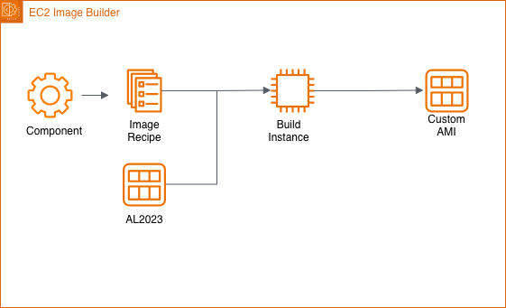

# AWS Parallel Compute Service

This reposity contains sample Terraform to deploy a cluster
using AWS Parallel Compute Service.

## Architure


The architure consistes of
- An LDAP server for authentication and authorization.
- A single login node.
- FSx OpenZFS file system for applications and users home directories, mounted at `/sw` and `/home`.
- FSx Lustre parallel file system, mounted at `/fsx` over EFA on the compute instances.
- An X86 compute queue consisting of hpc6a.48xlarge and hpc7a.96xlarge instances (default partition).
- An ARM compute queue consisting of m8g.16xlarge instances.

## Custom AMI


A custom AMI is created from the AL2023 base AMI. This AMI
has the following components installed
- PCS agent.
- EFA drivers.
- Lustre drivers.
- Slurm.
- SRSO mitigation turned off.
- CloudWatch agent.
- SSS set to do authentication and authorization against an LDAP server.

## Customization

Top-level variables should be set in the `terraform.tfvars` file before deployment.
The most important ones are
- `region` & `availability_zone`
- `ssh_key`
- `users`

The `region` and `availability_zone` are the AWS Region and Availability Zone the cluster should
be deployed in.

While the `ssh_key` is the public ssh key used for access to the
Amazon EC2 instances.

The `users` variable is a LDIF file name that contains all the
cluster users to add to LDAP. Users will ssh into the cluster
using only their ssh key, there is no password access.

Other variables are defined in `variables.tf` and of course can/should
be overridden in `terraform.tfvars`.

## Users LDIF

A user LDIF file needs to be created to grant access to the
cluster. This file is populated into LDAP via `ldapadd`.
The following is an example of a user definition.

```
dn: cn=Fred Smith,ou=people,dc=my-domain,dc=com
givenName: Fred
sn: Smith
cn: Fred Smith
uid: fsmith
uidNumber: 2000
gidNumber: 2000
homeDirectory: /home/fsmith
loginShell: /bin/bash
objectClass: inetOrgPerson
objectClass: posixAccount
objectClass: top
objectClass: ldapPublicKey
mail: fred.smith@example.com
sshPublicKey: ssh-ed25519 ABCDC3NzaC1lZDI1NTE5AAAAIA2dKyl6lAU+0gGefezaxqX8DtWCND6F/o/sjkS6zsvD
```

The `wheel` group has sudo privileges to to run `ALL` commands as `ALL` users.
If the user should be added to the `wheel` group, you need to add a
`memberUid` to the `wheel` distinguished name for the user. 
The following entry adds `fsmith` to the `wheel` DN.
```
dn: cn=wheel,ou=groups,dc=my-domain,dc=com
changetype: modify
add: memberUid
memberUid: fsmith
```

## Deployment

Deploying the stack is done by the typical Terraform project.

```
terraform init
terraform plan
terraform apply -auto-approve
```

# Dependency Graph

To create a dependency graph.
```
terraform graph -type=plan | dot -Tpng >graph.png
```

## Destroying

To tear it all down.
```
terraform destroy -auto-approve
```

The LDAP secret should be deleted by Terraform, if it isn't you can force a
deletion with the following command.
```
aws secretsmanager delete-secret --secret-id ldap-password --force-delete-without-recovery --region us-east-2
```
